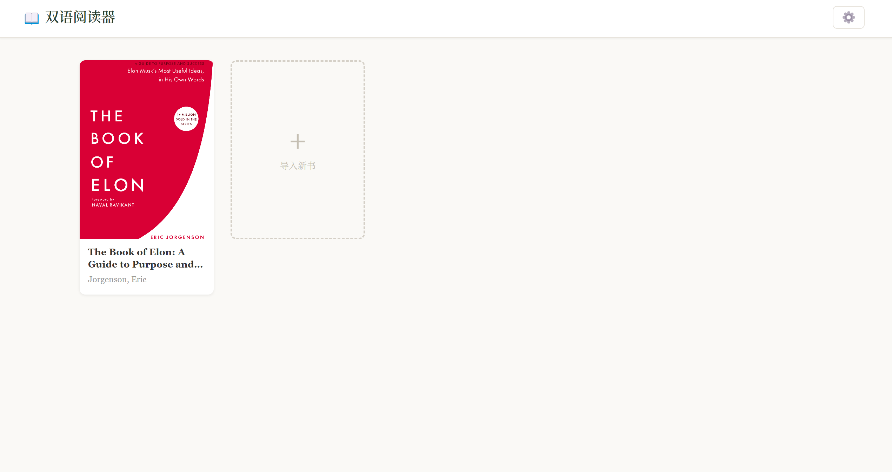
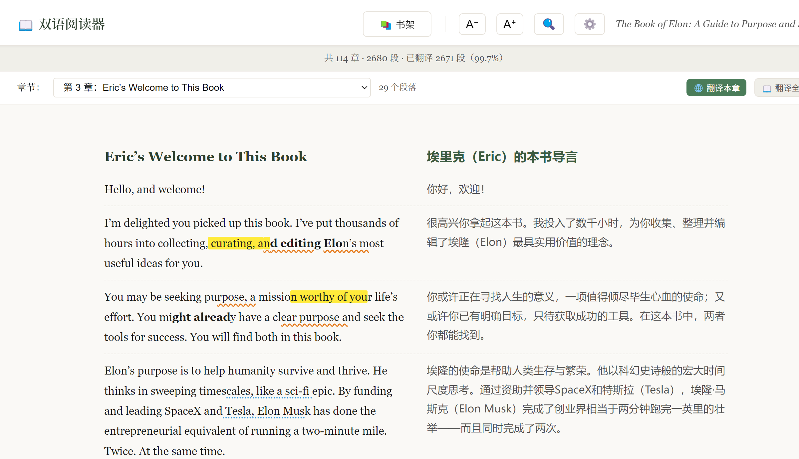
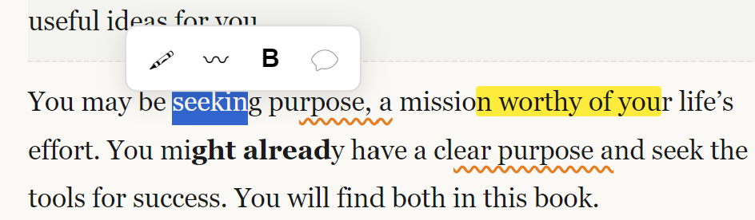
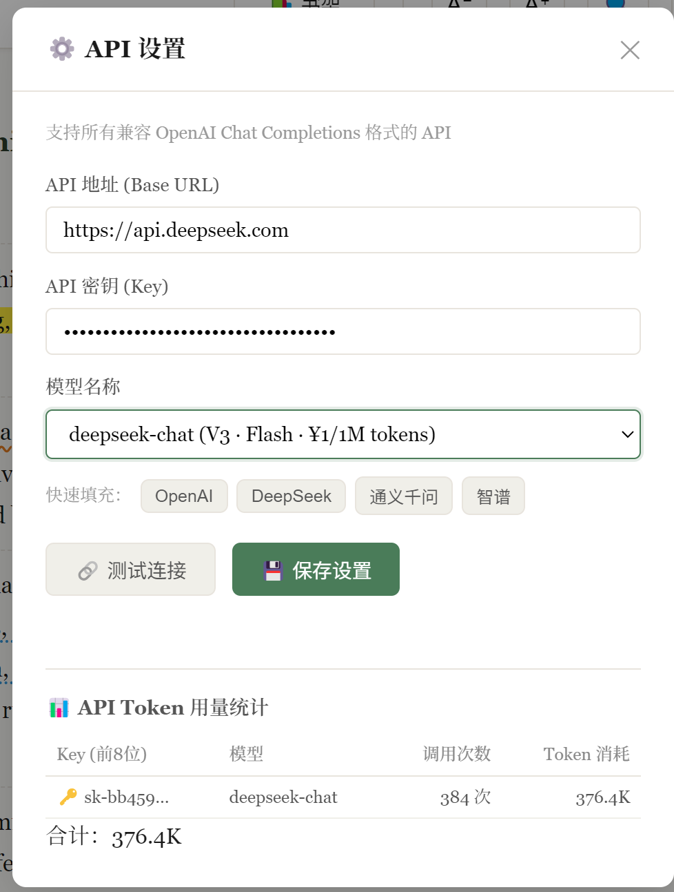

# 📖 Bilingual Book Reader

英文电子书双语辅助阅读桌面应用。导入 EPUB，AI 翻译，左英右中对照阅读。

---

## 📸 截图









---

## ✨ 功能

### 📚 书架

- 导入 EPUB，自动提取封面展示
- 右键菜单：开始阅读 / 查看笔记 / 导出 EPUB / 删除图书
- 阅读进度记忆，下次打开自动恢复到上次位置

### 📖 双语阅读

- 左英右中双栏对照，段落行自动对齐
- 章节导航 + 翻页按钮
- A⁻ / A⁺ 字体缩放
- Ctrl+F 全文搜索（英中双语匹配，跨章节跳转）

### 🌐 AI 翻译

- 支持 OpenAI / DeepSeek / 通义千问 / 智谱等所有 OpenAI 兼容接口
- 点击「翻译本章」逐章翻译，或「翻译全书」一键全译
- 翻译结果自动缓存，永不重复消耗 Token
- 支持停止翻译，断点续传
- Token 用量统计（按 API Key 分组）

### 📝 笔记标注

- 选中文字弹出工具栏：🖍 高亮 / 〰 波浪线 / 𝐁 加粗 / 💬 评论
- 同一位置可叠加多种标注
- 评论点击弹出卡片查看
- 右键标注可删除
- 笔记面板：右侧滑出，按章节分组，点击跳转

### 📄 导出

- 原版副本：EPUB 原样复制
- 双语版：原文 + 中文译文隔行穿插，保留原书排版，可在任何阅读器打开

---

## 🚀 使用

### 安装

```bash
git clone https://github.com/sparklejin/bilingual-book-reader.git
cd bilingual-book-reader
npm install
```

### 启动

```bash
npm start
```

或双击 `start.bat`

### 配置 API

1. 点击右上角 ⚙️ 按钮
2. 选择厂商预设（DeepSeek 推荐，¥1/百万 Token）
3. 填入 API Key
4. 点击「测试连接」验证

### 翻译

1. 打开一本英文 EPUB
2. 点击章节导航栏的「🌐 翻译本章」或「📖 翻译全书」
3. 翻译结果实时显示在右侧
4. 关闭应用后再打开，翻译自动恢复，无需重新翻译

---

## 🛠 技术栈

Electron · sql.js · cheerio · adm-zip · OpenAI Compatible API

---

## ⚠️ 注意事项

- API Key 存储在系统用户目录（`%APPDATA%/bilingual-book-reader/`），不会上传到 GitHub
- EPUB 书源文件请自行准备，项目不包含任何电子书
- 双语导出功能依赖已翻译的段落，未翻译部分保持原文
